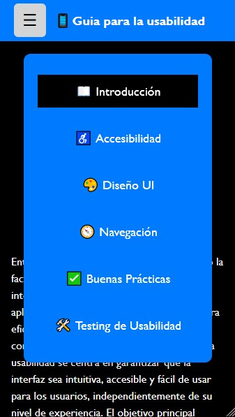
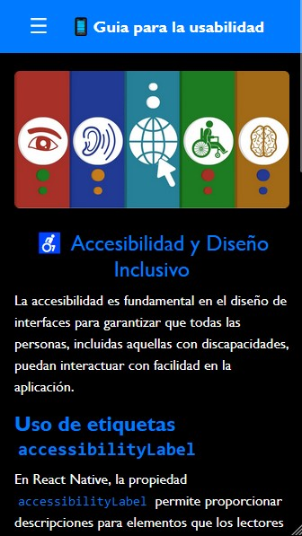

# 📱 Manual Interactivo de Usabilidad en Apps Móviles


## 📖 Descripción

Este proyecto es una aplicación interactiva desarrollada en **React** que funciona como un manual de usabilidad en aplicaciones móviles. Incluye contenido teórico, ejemplos prácticos y demostraciones interactivas de buenas prácticas en UI/UX y accesibilidad.

## 🚀 Características

- 📚 **Introducción** sobre usabilidad en apps móviles.
- 🎮 **Accesibilidad** para ilustrar conceptos clave.
- 🎨 **Diseño UI/UX y accesibilidad.**
- 🔍 **Navegación fluida con React Navigation.**
- ✅ **Buenas prácticas de usabilidad.**- 
- 🛠️ **Buenas prácticas de usabilidad.**

## Tecnologías utilizadas

- [React](https://react.dev/)
- [React Navigation](https://reactnavigation.org/)
- [Styled Components](https://styled-components.com/)
- [Jest](https://jestjs.io/) para pruebas básicas de usabilidad

## 📸 Capturas de pantalla

### 🔹 Pantalla de Inicio


### 🔹 Ejemplo Interactivo


## 🏗️ Instalación y ejecución

Sigue estos pasos para clonar y ejecutar el proyecto localmente:

```bash
# Clonar el repositorio
git clone https://github.com/tu-usuario/manual-usabilidad.git

# Moverse al directorio del proyecto
cd manual-usabilidad

# Instalar dependencias
npm install

# Ejecutar en modo desarrollo
npm start
